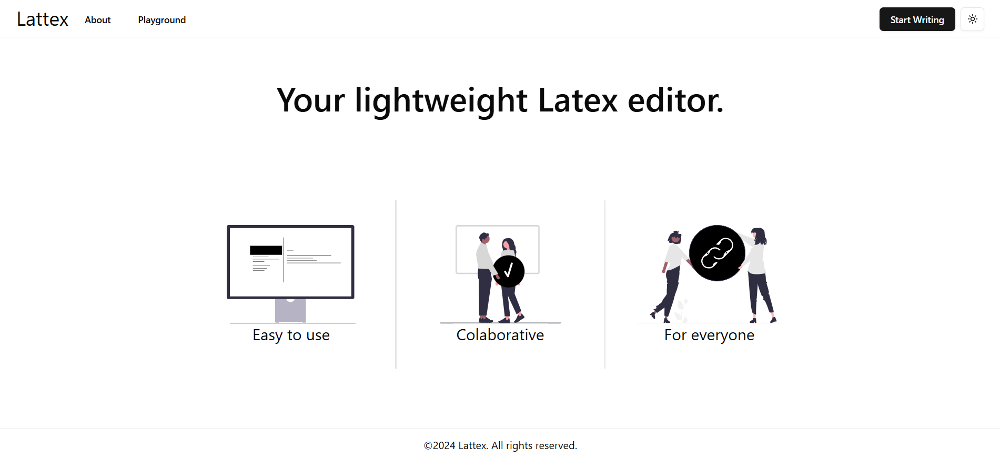
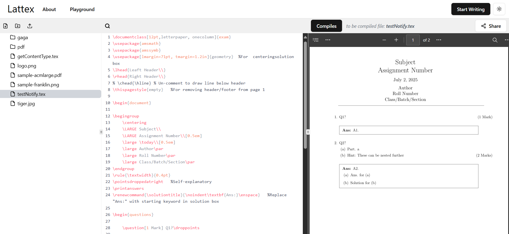
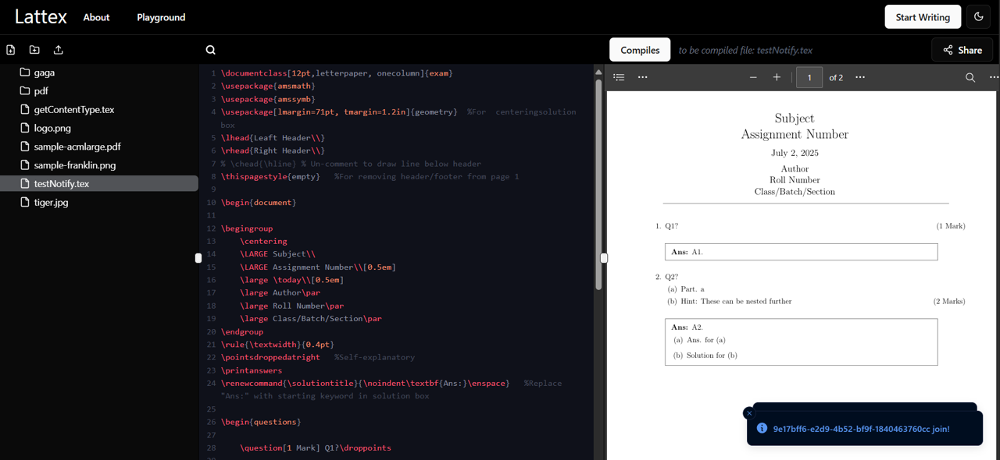

# 📄 lattex.org - Collaborative LaTeX Editor

A real-time, collaborative **LaTeX editor** built to make academic writing, research collaboration, and technical documentation seamless. Multiple users (up to 3) can edit the same document simultaneously with instant updates and live preview.

---

## 🚀 Features

- ✍️ **Real-time Collaboration** — Multiple users can edit together with conflict-free synchronization.
- 📂 **Project Management** — Organize multiple `.tex` files and resources.
- 🔒 **Authentication & Roles** — Secure login with support for multiple user roles.

---

## 🛠️ Tech Stack

- **Frontend**: React.js &nbsp;&nbsp;
- **Backend**: Golang &nbsp;&nbsp;
- **Database**: Supabase &nbsp;&nbsp;
- **Real-Time Communication**: WebSockets
- **Deployment**: Docker + AWS &nbsp;&nbsp; 

---

## 📸 Screenshots

---
